[뒤로](../README.md)
## 1. 개발환경 조성

다음은 개발환경을 조성하는 방법에 대한 안내입니다.

1. C:\\ 에서 다음 명령어를 실행하여 코드를 클론합니다.
    ```
    git clone https://github.com/hjhearts/oome.git
    ```
   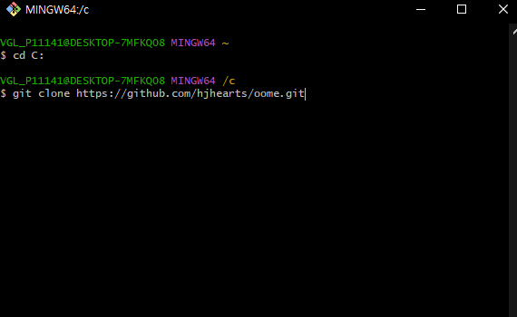
   
   프로젝트를 클론합니다.

2. oome는 root 프로젝트입니다. IntelliJ에서 로컬 Gradle7.4버전과 JDK 11이 정상적으로 설정되어 있는지 확인해주세요. \
 이후에는 공통으로 사용될 JDK와 Gradle home을 제공할 예정입니다.

3. IntelliJ의 "Edit Configuration"에서 Spring Boot Configuration을 생성합니다.
    1. 모듈을 "oome.oome-web-local.main"으로 설정합니다.
    2. 메인 클래스를 "org.oome.OomeWebLocalApplication"으로 설정합니다.
       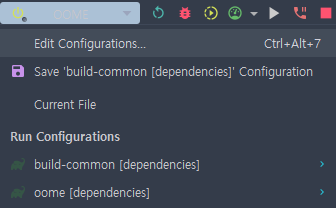
       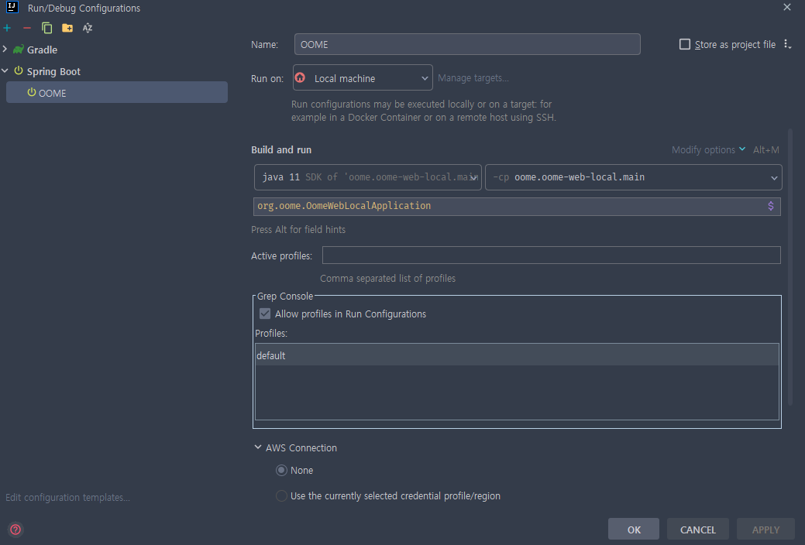

4. frontend 구성
   1. frontend 폴더로 이동하여 필요한 라이브러리를 다운로드받습니다.
   2. ```
      npm install http-proxy-middleware --save
      npm install axios --save
      ```
      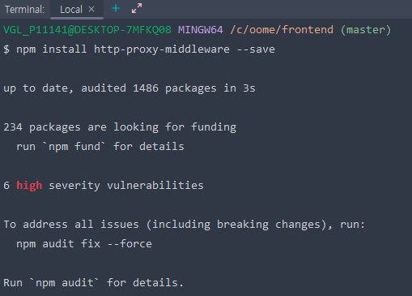
      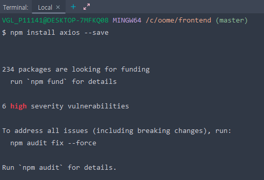
   3. 이후 oome-web-local 프로젝트를 빌드하여 static폴더로 react 파일을 떨굽니다.
      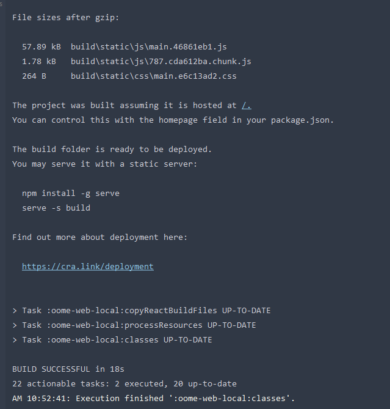
      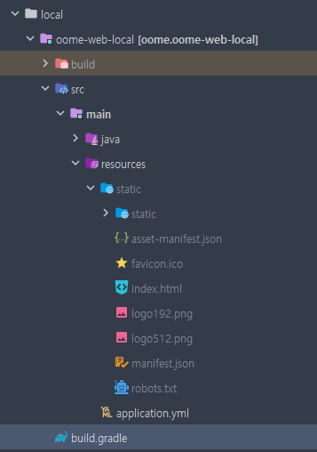
   
5. 애플리케이션을 실행하고 [localhost:8080](http://localhost:8080/) 으로 접속했을 때 다음과 같은 화면이 표시되어야 MVC가 정상작동합니다.\
      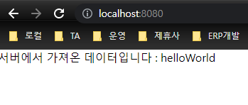
6. 다음 주소[/authcheck](http://localhost:8080/authcheck)으로 이동시 403 FORBIDDEN이 떨어져야 Security가 정상작동됩니다.\
      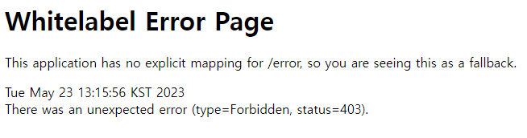
7. 다음 주소[/h2-console](http://localhost:8080/h2-console)로 이동하여 Driver-Class를
  ```net.sf.log4jdbc.sql.jdbcapi.DriverSpy```
   JDBC URL을 ```jdbc:log4jdbc:h2:mem:oome``` 로 설정하여 Connect 했을 때 두 개의 테이블(2023/05/23기준)이 생성되어있어야 DB가 정상작동합니다.\
   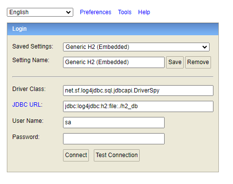
    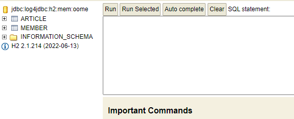