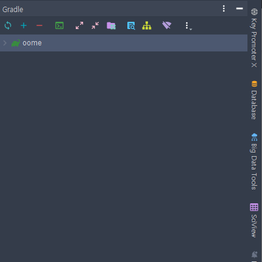

[뒤로](../README.md)
## 1. 개발환경 조성

다음은 개발환경을 조성하는 방법에 대한 안내입니다.

1. C:\\ 에서 다음 명령어를 실행하여 코드를 클론합니다.
    ```
    git clone https://github.com/hjhearts/oome.git
    ```
   
   
   프로젝트를 클론합니다.

2. oome는 root 프로젝트입니다. IntelliJ에서 로컬 Gradle7.4버전과 JDK 11이 정상적으로 설정되어 있는지 확인해주세요. \
 이후에는 공통으로 사용될 JDK와 Gradle home을 제공할 예정입니다.
    1. oome를 프로젝트로 열고 gradle refresh를 합니다. 
    2. 
3. IntelliJ의 "Edit Configuration"에서 Spring Boot Configuration을 생성합니다.
    1. 모듈을 "oome.oome-web-local.main"으로 설정합니다.
    2. 메인 클래스를 "org.oome.OomeWebLocalApplication"으로 설정합니다.
       
       
   3. VM옵션을 다음과 같이 정의합니다.
```
-Dspring.profiles.active=local
-Djasypt.encryptor.password=oome123!@#
-Djwt.secret=c4b615d236bb9f09f3f2b9fc66a4d439a3b92be4645eacf0920dc96a58247f3141754969d8f0b3de17f8a7f147e8ebe363872a4cda718a00699b0b46b2f86e8
-Xms2048m
-Xmx2048m
-XX:+UseG1GC
```

4. vs code 등 다른 에디터를 사용하는 경우엔 터미널에 다음과 같이 명령합니다
```shell
./gradlew --refresh-dependencies
./gradlew :oome-web-local:bootRun
```