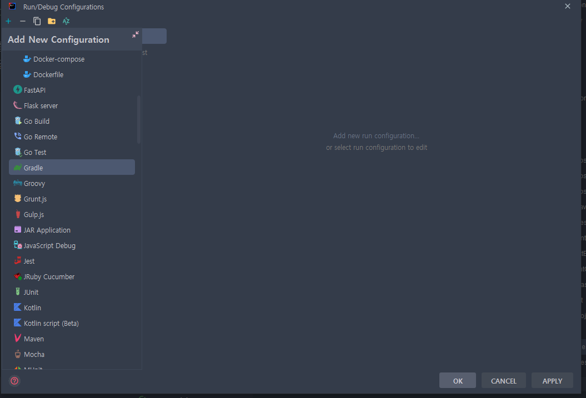
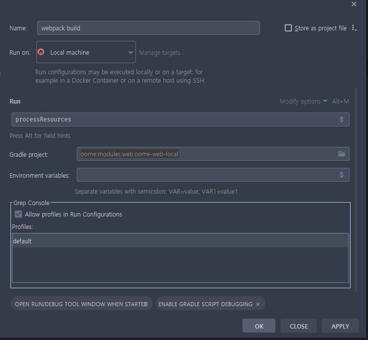

[뒤로](4-React개발가이드.md)
## 4-1. 빌드

1. 애플리케이션 실행 방법은 상기와 동일합니다.
2. 변경사항 발생시 리소스를 반영하기 위해 다음 방법을 사용합니다.
3. 인텔리제이 기준
   1. Edit Configuration을 엽니다
   2. +를 누르고 Gradle을 선택합니다.
   3. 
   4. 다음과 같이 설정합니다 gradle project => oome-web-local   Run => processResource
   5. 
   6. 변경사항이 발생하면 설정한 실행환경을 구동합니다.
   7. 
4. 터미널기준 (VS CODE등 사용자)
   1. oome 루트경로에서 터미널을 엽니다.
   2. 다음 명령어를 입력합니다. 
   3. ```shell
      ./gradlew :oome-web-local:processResource
      ```